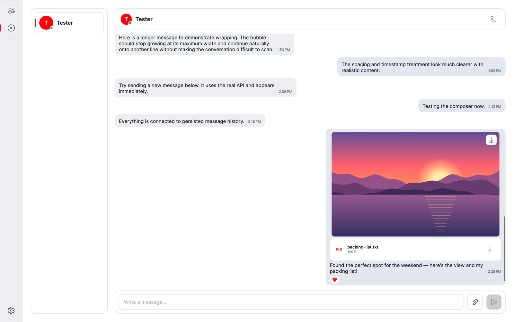
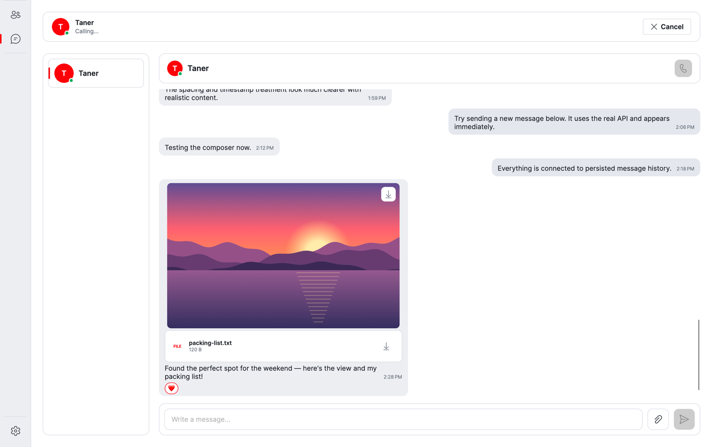
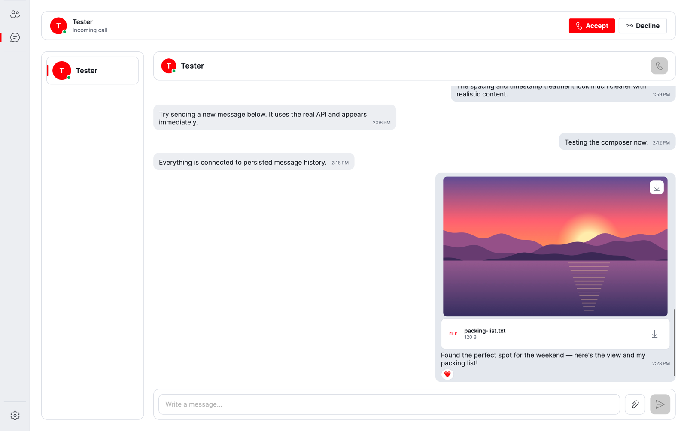
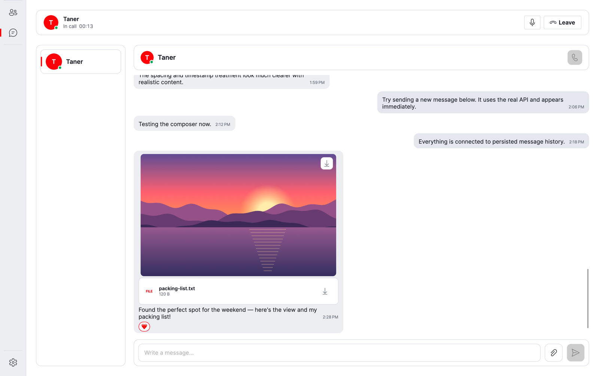
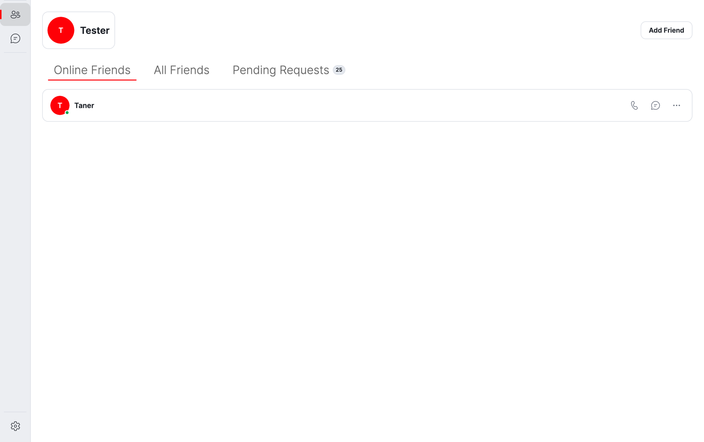
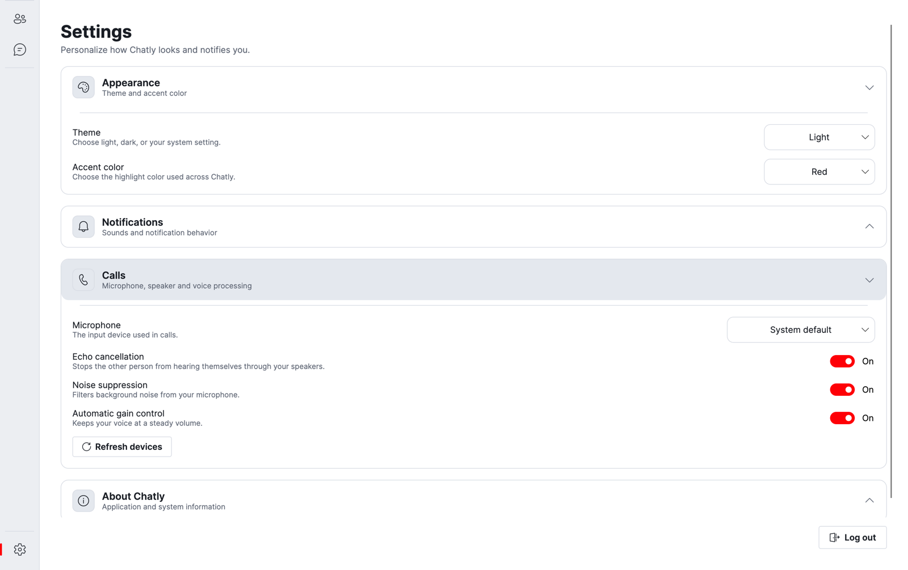

<div align="center">
  

  <h1>Chatly</h1>

  <p>Private one-to-one chats and voice calls — a native desktop app for Windows and macOS.</p>

  <p>
    <a href="https://github.com/taner04/Chatly/actions/workflows/ci.yml"></a>
    
    
    <a href="LICENSE"></a>
  </p>

  <p>
    <a href="#features">Features</a> ·
    <a href="#getting-started">Getting Started</a> ·
    <a href="#project-structure">Project Structure</a> ·
    <a href="#license">License</a>
  </p>

  
</div>

## About

Chatly is a messenger for people who talk to the same few friends every day. Add a friend, open the chat, and write, share files, react or call — everything updates live on every device you are signed in on.

> [!WARNING]
> Chatly is under active development. It is developed and tested on macOS; **Windows support is not fully tested yet**, so expect rough edges there, especially with voice calls. See [Project Status](#project-status).

## Table of Contents

- [Features](#features)
- [Screenshots](#screenshots)
- [Getting Started](#getting-started)
  - [Prerequisites](#prerequisites)
  - [Installation](#installation)
  - [Configuration](#configuration)
- [Built With](#built-with)
- [Project Status](#project-status)
- [Project Structure](#project-structure)
- [License](#license)

## Features

- **Real-time chat** — messages appear instantly, with typing indicators, unread counts and read state
- **Files and images** — attach files or drag them into the window
- **Reactions** — react to any message with emoji
- **Voice calls** — one-to-one calls with echo cancellation, noise suppression and automatic gain control, plus mute and microphone/speaker selection
- **Multiple devices** — accept a call on one device and your other devices stop ringing
- **Friends** — search by username, send and answer friend requests, see who is online
- **Personalization** — light, dark or system theme, accent colors, username and profile picture
- **Sounds and notifications** — a ringtone while a call is ringing, and a notification sound for new messages and friend requests that you can turn on or off in the settings
- **Secure sign-in** — Auth0 with tokens stored in the operating system's secure storage

## Screenshots

<table>
  <tr>
    <td width="50%"></td>
    <td width="50%"></td>
  </tr>
  <tr>
    <td align="center">Calling a friend</td>
    <td align="center">Incoming call</td>
  </tr>
  <tr>
    <td width="50%"></td>
    <td width="50%"></td>
  </tr>
  <tr>
    <td align="center">In a call</td>
    <td align="center">Friends and online status</td>
  </tr>
  <tr>
    <td colspan="2" align="center"></td>
  </tr>
  <tr>
    <td colspan="2" align="center">Appearance and call settings</td>
  </tr>
</table>

## Getting Started

### Prerequisites

- [.NET 10 SDK](https://dotnet.microsoft.com/download/dotnet/10.0)
- [Docker Desktop](https://www.docker.com/products/docker-desktop)
- An [Auth0](https://auth0.com/signup) account
- Windows or macOS for the desktop client

### Installation

1. Clone the repository:

   ```bash
   git clone https://github.com/taner04/Chatly
   cd Chatly
   ```

2. Configure Auth0 and create the three `appsettings.json` files described in [Configuration](#configuration).

3. Start PostgreSQL, Azure Storage, Papercut SMTP, the LiveKit media server, the database migrations and the Web API:

   ```bash
   dotnet run --project ./tools/Chatly.AppHost
   ```

   The Aspire dashboard lists the running resources. In development, the Scalar API documentation is available from the `chatly-api` resource at `/scalar/v1`.

4. In another terminal, start the desktop client:

   ```bash
   dotnet run --project ./src/Chatly.Desktop
   ```

   The client waits until the API, database and blob storage are ready, then opens the Auth0 sign-in.

### Configuration

<details>
<summary><strong>Auth0</strong></summary>

1. Go to the [Auth0 Dashboard](https://manage.auth0.com/)
2. Create a **Native Application**
3. Create an **API** in Auth0 and set its **Identifier** (Audience)
4. Enable refresh tokens and offline access for the application
5. Copy the **Domain**, **Client ID**, and **API Audience**
6. Set the following URLs in the Auth0 application settings:
   - **Allowed Callback URLs**: `http://127.0.0.1:7890/callback/`
   - **Allowed Logout URLs**: `http://127.0.0.1:7890/callback/`
   - Add `http://127.0.0.1:7891/callback/` to both lists to run two clients side by side with `scripts/unix/launch-two-clients.sh` or `scripts/windows/launch-two-clients.ps1`

</details>

<details>
<summary><strong>AppHost</strong> — <code>tools/Chatly.AppHost/appsettings.json</code></summary>

```json
{
  "Logging": {
    "LogLevel": {
      "Default": "Information",
      "Microsoft.AspNetCore": "Warning",
      "Aspire.Hosting.Dcp": "Warning",
      "Aspire.Hosting.Dashboard": "Error"
    }
  },
  "PapercutOption": {
    "Image": "changemakerstudiosus/papercut-smtp",
    "Tag": "7.6",
    "HttpPort": 8025,
    "SmtpPort": 2525
  },
  "EmailOption": {
    "SenderName": "Chatly",
    "SenderEmail": "noreply@chatly.local",
    "Username": "",
    "Password": "",
    "UseSsl": false
  },
  "LiveKitOption": {
    "Image": "livekit/livekit-server",
    "Tag": "v1.13.7",
    "BindAddress": "0.0.0.0",
    "NodeIp": "127.0.0.1",
    "HttpPort": 7880,
    "RtcTcpPort": 7881,
    "RtcUdpPort": 7882,
    "ApiKey": "your-livekit-api-key",
    "ApiSecret": "your-livekit-api-secret-at-least-32-characters"
  }
}
```

The AppHost starts Papercut and the LiveKit media server with these values. It passes the LiveKit server URL, API key and secret to the Web API, and points the Web API's `EmailOption` at Papercut's SMTP endpoint using the sender and login values from `EmailOption`.

</details>

<details>
<summary><strong>Web API</strong> — <code>src/Chatly.WebApi/appsettings.json</code></summary>

```json
{
  "Logging": {
    "LogLevel": {
      "Default": "Information",
      "Microsoft.AspNetCore": "Warning"
    }
  },
  "AllowedHosts": "*",
  "Auth0Option": {
    "Domain": "your-auth0-domain",
    "Audience": "your-auth0-api-audience",
    "ClientId": "your-auth0-client-id",
    "UsePersistentStorage": false
  }
}
```

</details>

<details>
<summary><strong>Desktop client</strong> — <code>src/Chatly.Desktop/appsettings.json</code></summary>

```json
{
  "Auth0Option": {
    "Domain": "your-auth0-domain",
    "ClientId": "your-auth0-client-id",
    "Audience": "your-auth0-api-audience",
    "ConnectionName": "Username-Password-Authentication",
    "Scope": "openid profile email offline_access",
    "RedirectUri": "http://127.0.0.1:7890/callback/"
  },
  "DesktopProfileOption": {
    "Name": "default"
  },
  "WebApiClientOption": {
    "BaseAddress": "https://localhost:7123/",
    "TimeoutInSeconds": 30
  }
}
```

</details>

## Built With

| Area | Technology |
|---|---|
| Desktop client | [Avalonia](https://avaloniaui.net/) 12, CommunityToolkit.Mvvm |
| Backend | ASP.NET Core Minimal APIs, SignalR, Mediator (CQRS) |
| Voice | [LiveKit](https://livekit.io/) media server, WebRTC in a native WebView |
| Data | PostgreSQL with Entity Framework Core, Azure Blob Storage for files |
| Sign-in | Auth0 (OIDC with PKCE) |
| Local orchestration | .NET Aspire, OpenTelemetry, health checks |
| API docs | Scalar |

## Project Status

Chatly is a work in progress. These tasks are still open:

- [ ] Test the desktop client end to end on Windows, including voice calls (`scripts/windows/webview-call-probe.ps1`)
- [ ] Show active sessions in the settings and let users sign out of other devices
- [ ] Add a setting to turn the ringtone on or off
- [ ] Let users withdraw a friend request they have sent
- [ ] Let users block other users
- [ ] Add rate limiting to the API
- [ ] Let users edit and reply to messages
- [ ] Show system notifications while the app is in the background

## Project Structure

```
Chatly/
├── docs/                                          # Documentation, logo and screenshots
├── scripts/                                       # Platform-specific development helpers
│   ├── unix/                                      # Linux/macOS test and desktop launch scripts
│   └── windows/                                   # PowerShell test and desktop launch scripts
├── src/
│   ├── Chatly.Contracts/                          # REST and SignalR contracts
│   ├── Chatly.Desktop/                            # Avalonia desktop client and WebView call media
│   ├── Chatly.Shared/                             # Shared options and utilities
│   ├── Chatly.SourceGenerator/                    # Dependency injection and option source generators
│   └── Chatly.WebApi/                             # ASP.NET Core API, SignalR hubs, and persistence
├── tests/
│   ├── Chatly.Desktop.UnitTests/                  # Desktop services, state, view model, and sound asset tests
│   ├── Chatly.SourceGenerator.UnitTests/          # Generator output and diagnostics tests
│   ├── Chatly.WebApi.IntegrationTests/            # API and hub tests with Testcontainers (requires Docker)
│   ├── Chatly.WebApi.UnitTests/                   # Contract serialization and LiveKit unit tests
│   └── Chatly.WebViewCallProbe.IntegrationTests/  # Explicit WebView WebRTC checks per OS
└── tools/
    ├── Chatly.AppHost/                            # .NET Aspire orchestration
    ├── Chatly.MigrationService/                   # Database migrations and development seeding
    ├── Chatly.ServiceDefaults/                    # Telemetry, health, discovery, and resilience
    └── Chatly.WebViewCallProbe/                   # WebView WebRTC capability check for Windows and macOS
```

## License

Chatly is licensed under the [MIT License](LICENSE).
